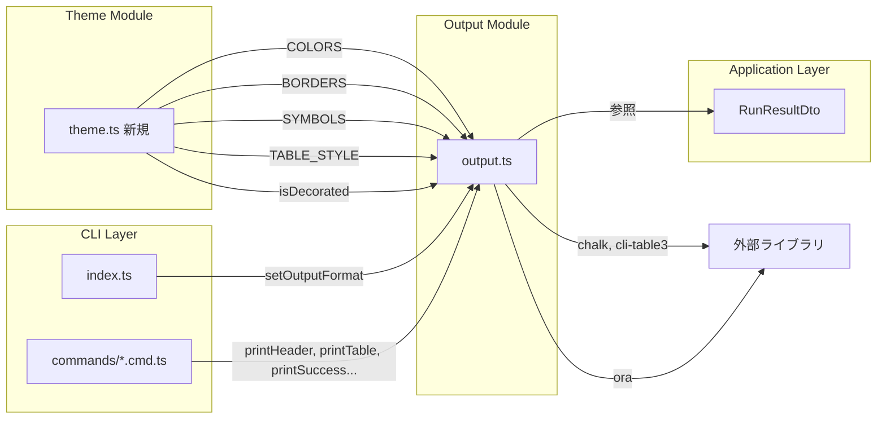
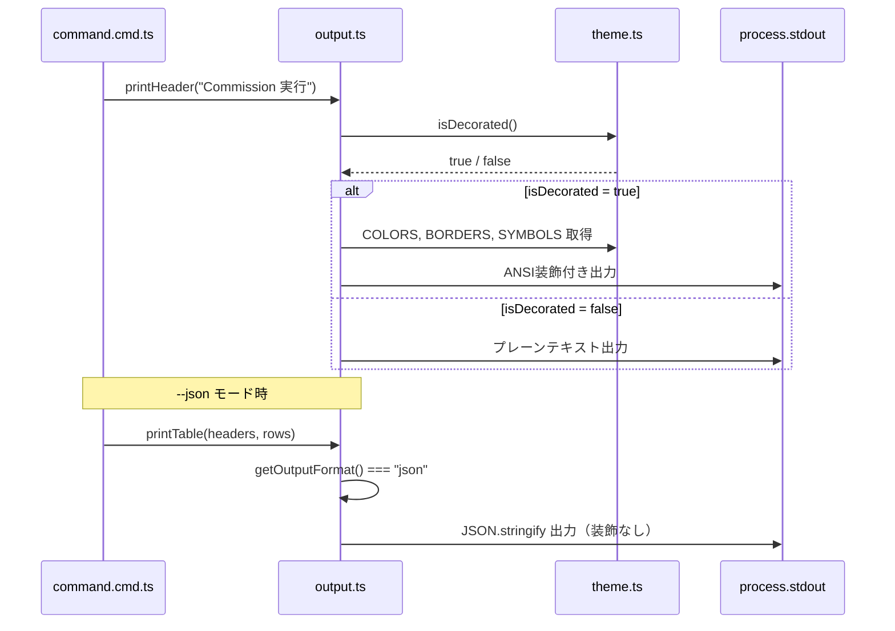

# 技術設計: CLI UI リニューアル（Biohazard テーマ）

## 方針

新規モジュール `src/cli/theme.ts` にテーマ定数を集約し、既存の `src/cli/output.ts` をテーマ対応に改修する。各コマンドファイル内の直接的な chalk 呼び出しは output.ts の関数経由に統一し、`--json` / `NO_COLOR` 判定を output.ts 内で一元管理する。

## 要件→設計マッピング

| 要件# | 設計要素 | 変更ファイル |
|--------|---------|-------------|
| 1 | `COLORS`, `BORDERS`, `SYMBOLS` 定数オブジェクト | `src/cli/theme.ts`（新規） |
| 2 | `printHeader()` 関数（ボックス罫線バナー） | `src/cli/output.ts` |
| 3 | `printSuccess` / `printError` / `printWarning` / `printInfo` をテーマシンボル・カラーに置換 | `src/cli/output.ts` |
| 4 | `printTable` の chars / head / border スタイルを theme.ts の `TABLE_STYLE` で上書き | `src/cli/output.ts` |
| 5 | `printRunResult` をパネル形式（box-drawing）に刷新 | `src/cli/output.ts` |
| 6 | `createSpinner()` ファクトリ関数（ora + テーマ色） | `src/cli/output.ts` |
| 7 | `printSectionDivider()` ユーティリティ関数 | `src/cli/output.ts` |
| 8 | `printProgressBar()` ユーティリティ関数 | `src/cli/output.ts` |
| 9 | `isJsonMode()` ガードを各出力関数の先頭に配置（既存踏襲） | `src/cli/output.ts` |
| 10 | `isDecorated()` 判定関数（`NO_COLOR` / TTY 検出） | `src/cli/theme.ts`（新規） |

## 構成図



## 変更ファイル一覧

| ファイル | 変更内容 | 新規/修正 |
|---------|---------|----------|
| `src/cli/theme.ts` | カラーパレット（`COLORS`）、ボーダー文字セット（`BORDERS`）、シンボル（`SYMBOLS`）、テーブルスタイル（`TABLE_STYLE`）、`isDecorated()` 関数を定義 | 新規 |
| `src/cli/output.ts` | 全出力関数をテーマ対応に改修。`printHeader`, `printSectionDivider`, `printProgressBar`, `createSpinner` を追加。`isDecorated()` によるフォールバック分岐を導入 | 修正 |
| `src/cli/index.ts` | `printHeader()` 呼び出しを preAction フックに追加（任意） | 修正 |
| `src/cli/commands/commission.cmd.ts` | 直接 chalk 呼び出しを output.ts 関数に置換、`printSectionDivider` 使用 | 修正 |
| `src/cli/commands/run.cmd.ts` | スピナーを `createSpinner()` に置換、`printProgressBar` 使用 | 修正 |
| `src/cli/commands/review.cmd.ts` | 直接 chalk 呼び出しを output.ts 関数に置換 | 修正 |
| `src/cli/commands/catalog.cmd.ts` | 直接 chalk 呼び出しを output.ts 関数に置換 | 修正 |
| `src/cli/commands/task.cmd.ts` | 直接 chalk 呼び出しを output.ts 関数に置換 | 修正 |
| その他 `commands/*.cmd.ts` | chalk 直接使用箇所をテーマ関数に置換（段階的） | 修正 |

## データの流れ



### theme.ts の主要エクスポート

```typescript
/** カラーパレット（chalk インスタンス） */
export const COLORS = {
  primary: chalk.hex("#CC0000"),      // Biohazard レッド
  secondary: chalk.hex("#1A472A"),    // ダークグリーン
  accent: chalk.hex("#D4A017"),       // 琥珀（アンバー）
  muted: chalk.hex("#4A4A4A"),        // ダークグレー
  text: chalk.hex("#C0C0C0"),         // ライトグレー
  success: chalk.hex("#2ECC40"),      // グリーン
  error: chalk.hex("#FF4136"),        // レッド
  warning: chalk.hex("#FF851B"),      // オレンジ
  info: chalk.hex("#7FDBFF"),         // シアン
} as const;

/** シンボル文字セット */
export const SYMBOLS = {
  biohazard: "☣",
  success: "☣",      // テーマ統一: ✓ → ☣
  error: "✕",
  warning: "⚠",
  info: "▸",
  bullet: "›",
  arrow: "▸",
  line: "═",
} as const;

/** ボーダー文字セット（box-drawing） */
export const BORDERS = {
  topLeft: "╔", topRight: "╗",
  bottomLeft: "╚", bottomRight: "╝",
  horizontal: "═", vertical: "║",
  titleLeft: "╣", titleRight: "╠",
} as const;

/** cli-table3 用スタイル定義 */
export const TABLE_STYLE: Record<string, string> = {
  "top": "═", "top-mid": "╤", "top-left": "╔", "top-right": "╗",
  "bottom": "═", "bottom-mid": "╧", "bottom-left": "╚", "bottom-right": "╝",
  "left": "║", "left-mid": "╟", "mid": "─", "mid-mid": "┼",
  "right": "║", "right-mid": "╢", "middle": "│",
};

/** 装飾有効判定 */
export function isDecorated(): boolean;
```

### isDecorated() の判定ロジック

| 条件 | 結果 |
|------|------|
| `outputFormat === "json"` | `false` |
| `process.env.NO_COLOR` が存在 | `false` |
| `!process.stdout.isTTY` | `false` |
| それ以外 | `true` |

## エラー時の動作

| エラー | 対処 |
|--------|------|
| ターミナル幅が狭すぎてバナーが崩れる | `process.stdout.columns` を参照し、40未満の場合はバナーを省略してタイトルのみ出力 |
| `NO_COLOR` 設定時にシンボル文字が表示できない | シンボルは Unicode のため `NO_COLOR` でも表示。カラーのみ無効化 |
| chalk の hex カラーが 256 色未満ターミナルで劣化 | chalk が自動的に最も近い色にフォールバック（chalk 5.x の標準動作） |
| `cli-table3` の chars が不正 | `TABLE_STYLE` を `as const` で型安全に定義し、キー漏れをコンパイル時に検出 |
| `--json` モードで `printHeader` が呼ばれた | `isDecorated()` が `false` を返すため何も出力しない（JSON の純粋性を維持） |
| ora スピナーが非 TTY 環境でハングする | `ora({ isEnabled: process.stdout.isTTY })` で自動無効化（ora 標準機能） |

## テスト方針

- **theme.ts 単体テスト**
  - `COLORS`, `BORDERS`, `SYMBOLS` が期待する型・値でエクスポートされること
  - `isDecorated()` が `NO_COLOR=1` で `false`、未設定かつ TTY で `true` を返すこと
  - `isDecorated()` が非 TTY（`isTTY = undefined`）で `false` を返すこと

- **output.ts 単体テスト**
  - `printHeader()` が `isDecorated() = true` 時にボックス罫線を含む出力をすること
  - `printHeader()` が `isDecorated() = false` 時に装飾なしテキストを出力すること
  - `printRunResult()` がパネル形式で出力されること（status ごとの色分岐を確認）
  - `printTable()` がテーマ適用済みの chars で描画されること
  - `printSuccess` / `printError` / `printWarning` / `printInfo` がテーマシンボルを使用すること
  - `printSectionDivider()` が `═══╣ TITLE ╠═══` 形式で出力されること
  - `printProgressBar()` が `[████░░░░] 3/7` 形式で出力されること
  - `--json` モード時に全関数が ANSI エスケープを含まないこと

- **スナップショットテスト**
  - 主要出力関数（`printHeader`, `printRunResult`, `printTable`）の出力スナップショットを保持し、意図しないレグレッションを検出

- **結合テスト**
  - `atelier commission list` 実行時にテーマ適用済みテーブルが表示されること
  - `NO_COLOR=1 atelier commission list` 実行時にプレーンテキスト出力になること
  - `atelier --json commission list` 実行時に純粋な JSON が出力されること
