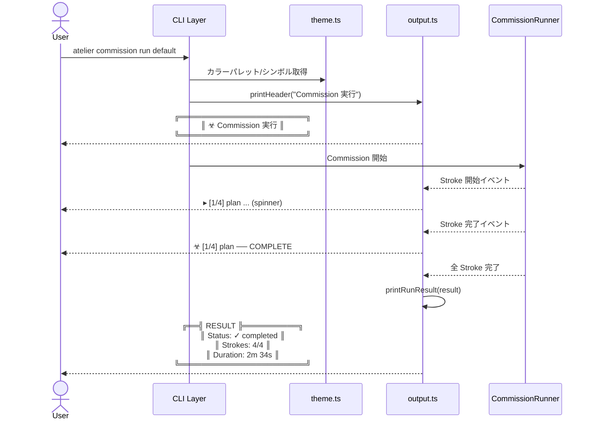

# 要件定義: CLI UI リニューアル（Biohazard テーマ）

## 背景

現在の atelier CLI は chalk による基本的な色分け＋cli-table3 のプレーンなテーブルで出力しており、視覚的なインパクトに欠ける。ユーザーは「バイオハザード（Resident Evil）」風の、ダーク＆インダストリアルな雰囲気を持つ凝った CLI UI を望んでいる。

既存の `src/cli/output.ts` を中心に、テーマシステムの導入とUIコンポーネントの刷新を行い、CLI 操作体験を大幅に向上させる。

## ゴール

- Biohazard 風のダーク＆警告感あるビジュアルテーマを CLI 全体に適用する
- ヘッダー、ボーダー、ステータス表示などの UI コンポーネントを刷新する
- 既存の出力関数（`printSuccess`, `printError`, `printTable` 等）を置き換え、全コマンドに一貫したテーマを反映する
- Commission 実行中のリアルタイム進捗表示を強化する

## 要件一覧

| # | 要件 | 優先度 | 完了条件 |
|---|------|--------|---------|
| 1 | **テーマ定数モジュール**: Biohazard テーマのカラーパレット（赤/暗緑/琥珀/グレー）、ボーダー文字セット、シンボル文字セットを `src/cli/theme.ts` に定義する | Must | テーマ定数がエクスポートされ、他モジュールから参照できる |
| 2 | **ヘッダーバナー**: 起動時・コマンド実行時に Biohazard 風の装飾付きヘッダー（ボックス罫線 + タイトル + バージョン）を表示する | Must | `atelier` 起動時にテーマ付きバナーが表示される |
| 3 | **ステータスメッセージ刷新**: `printSuccess` / `printError` / `printWarning` / `printInfo` をテーマ対応に置き換え、Biohazard 風シンボル（☣, ⚠, ✕ 等）とカラーで出力する | Must | 全既存呼び出し箇所でテーマ付きメッセージが表示される |
| 4 | **テーブル表示刷新**: `printTable` をテーマカラーのボーダー・ヘッダー色に対応させ、罫線スタイルを Biohazard 風（重厚なボーダー）に変更する | Must | `commission list` 等のテーブル出力がテーマ適用済みになる |
| 5 | **実行結果パネル**: `printRunResult` をボックス罫線で囲んだパネル形式に刷新し、ステータスに応じた色・シンボルで表示する | Must | Commission 実行後の結果表示がパネル形式になる |
| 6 | **スピナーのテーマ適用**: ora スピナーのスタイル（色、テキスト、シンボル）をテーマに合わせる | Should | Commission 実行中のスピナーがテーマカラーで表示される |
| 7 | **セクション区切り**: コマンド出力のセクション間に Biohazard 風の装飾ライン（`═══╣ SECTION ╠═══` 等）を挿入するユーティリティ関数を追加する | Should | 複数セクションがある出力で装飾区切りが使われる |
| 8 | **進捗バー**: Commission の Stroke 実行進捗をバー形式（`[████░░░░] 3/7 strokes`）で表示する | Should | 複数 Stroke の Commission 実行時に進捗バーが表示される |
| 9 | **JSON 出力モードとの互換**: `--json` フラグ指定時はテーマ装飾を一切適用せず、現行通りの純粋な JSON を出力する | Must | `--json` 時に ANSI エスケープやボーダーが混入しない |
| 10 | **NO_COLOR / CI 環境対応**: `NO_COLOR` 環境変数または非 TTY 出力時はカラー・装飾を無効化するフォールバックを実装する | Should | `NO_COLOR=1 atelier commission list` でプレーンテキスト出力になる |

## 操作の流れ

## 対象外

- **TUI フレームワーク導入（Ink 等）**: 今回は chalk + cli-table3 の既存依存のみで実現する。React ベースの TUI は導入しない
- **インタラクティブメニュー刷新**: `interactive.cmd.ts` の選択 UI（readline ベース）は今回変更しない
- **カスタムテーマ切替機能**: テーマは Biohazard 固定。ユーザーが `studio.yaml` でテーマを切り替える機能は今回スコープ外
- **サウンド・通知**: 完了時のサウンド再生やデスクトップ通知は対象外
- **アニメーション**: スキャンライン効果やタイピングアニメーション等のリッチアニメーションは対象外

## 未決事項

- ヘッダーバナーの ASCII アート（ロゴ）を追加するかどうか（トークンとターミナル幅の兼ね合い）
- `printTable` のボーダースタイルを `cli-table3` のカスタム chars で実現可能な範囲の確認
- `boxen` パッケージの追加導入を許容するか、自前の box-drawing ユーティリティで済ませるか
