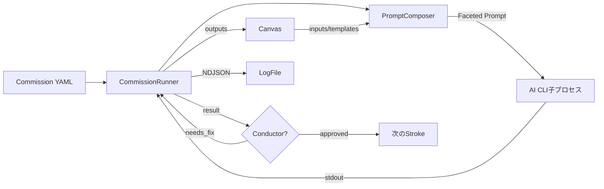
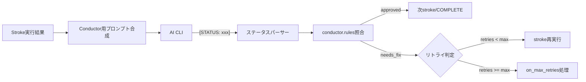

# 技術設計書

## 概要

ATELIERのコア機能安定化に関する技術設計。既存のDDD+ヘキサゴナルアーキテクチャを維持しつつ、7つの要件に対する設計方針と変更箇所を定義する。

本設計は既存コードへの**改善・補完**であり、アーキテクチャの再構築は行わない。

## 操作フローとUseCase分析

### 主要な操作フロー

```
ユーザー操作                    システム内部
─────────────────────         ────────────────────────────
atelier "タスク"               → run.cmd → RunCommissionUseCase
  --commission default           → CommissionRunner.run()
  --direct                     → DirectRunUseCase → Medium直接呼び出し
atelier talk                   → InteractiveSessionUseCase
  /go                            → CommissionRunner.run()
  /spec                          → spec-driven Commission実行
atelier "タスク" --commission   → RunCommissionUseCase
  spec-driven                      → requirements → design → tasks → implement → test → review
atelier task run               → QueueTaskUseCase → CommissionRunner.run() × N
```

### 名詞・動詞の分類

| 名詞（エンティティ/値オブジェクト） | 動詞（操作） |
|-------------------------------------|-------------|
| Commission | 読み込む、検証する、実行する |
| Stroke | 実行する、遷移する、リトライする |
| Canvas | 読む、書く、スナップショットを取る、復元する |
| Medium | 利用可否を確認する、プロンプトを実行する、中断する |
| Palette | 解決する、ペルソナを抽出する |
| Critique | 評価する、リトライ判定する |
| Conductor | 結果を評価する、ステータスを返す |
| ArpeggioRunner | CSVをパースする、バッチ分割する、並列実行する、マージする |
| Session | 作成する、保存する、復帰する |

### UseCase手順書

**UC-1: Commission実行**
1. Commission YAML読み込み・検証
2. Git worktree作成（--skip-gitでなければ）
3. stroke定義からループ開始
4. 各strokeでFaceted Promptを合成
5. Medium子プロセスを起動、結果をCanvasに保存
6. Conductor設定があればAI判定を実行
7. transition判定 → 次stroke or COMPLETE
8. loop_monitorでサイクル検出
9. 結果ログを保存

**UC-2: talk対話→実行**
1. セッション作成、Policy読み込み
2. 対話ループ（メッセージ送受信）
3. /requirements → 構造化要件定義モード
4. /save → 要件定義書保存
5. /go → 会話要約 → Commission選択 → UC-1へ

**UC-3: Arpeggioバッチ実行**
1. CSVファイル読み込み・パース
2. batch_sizeでバッチ分割
3. セマフォで並列度制御
4. 各バッチでテンプレート展開 → Medium実行
5. 失敗時は指数バックオフでリトライ
6. 全結果をmerge戦略でマージ

## 要件マッピング

| 要件# | 要件名 | 設計対象 | 変更種別 |
|--------|--------|----------|----------|
| 1 | Commission実行エンジン安定化 | CommissionRunner, Easel | 改善 |
| 2 | Canvas状態管理 | Canvas | テスト追加（実装済み） |
| 3 | テスト追加 | tests/ 新規作成 | 新規 |
| 4 | Arpeggio | ArpeggioRunner | テスト追加（実装済み） |
| 5 | talk対話モード | InteractiveSession | 改善 + テスト |
| 6 | Conductor/Critique完成 | CommissionRunner, CritiqueService | 新規実装 |
| 7 | 仕様駆動開発Commission | builtin/commissions, builtin/instructions, builtin/contracts, SpecWriter | 新規 |

## アーキテクチャ

既存のレイヤー構成を維持する。変更は各レイヤー内に閉じる。

```
┌──────────────────────────────────────────────────────────┐
│ CLI Layer (src/cli/)                                     │
│  run.cmd.ts, interactive.cmd.ts                          │
│  ※変更なし（既存インターフェースを維持）                    │
├──────────────────────────────────────────────────────────┤
│ Application Layer (src/application/)                     │
│  CommissionRunner ← 【要件1】エラーハンドリング強化         │
│  ArpeggioRunner   ← 【要件4】テスト追加                   │
│  InteractiveSession ← 【要件5】フロー検証                 │
├──────────────────────────────────────────────────────────┤
│ Domain Layer (src/domain/)                               │
│  Canvas           ← 【要件2】テスト追加                    │
│  PromptComposer   ← 【要件3】テスト追加                   │
│  CritiqueService  ← 【要件6】Conductor連携追加            │
│  AggregateEvaluator ← 【要件3】テスト追加                 │
├──────────────────────────────────────────────────────────┤
│ Adapters (src/adapters/)                                 │
│  Claude/Codex/Gemini ← 【要件3】テスト追加                │
├──────────────────────────────────────────────────────────┤
│ Infrastructure (src/infrastructure/)                     │
│  subprocess.ts    ← 変更なし                              │
│  event-emitter.ts ← 変更なし                              │
├──────────────────────────────────────────────────────────┤
│ Tests (tests/) ← 【要件3】新規ディレクトリ                 │
│  unit/domain/     ← Canvas, PromptComposer, Critique等    │
│  unit/application/ ← CommissionRunner, Arpeggio           │
│  unit/adapters/   ← Medium adapters                       │
│  integration/     ← end-to-end Commission実行             │
└──────────────────────────────────────────────────────────┘
```

## データフロー

### Commission実行のデータフロー



### Conductor判定のデータフロー（要件6 - 新規）



## コンポーネントとインターフェース

### 要件1: CommissionRunner改善

**変更箇所**: `src/application/services/commission-runner.service.ts`

強化ポイント：
- タイムアウト時のgraceful shutdown（SIGTERMの後SIGKILLフォールバック）
- 非ゼロ終了コード時のエラー情報をRunErrorDtoに構造化
- loop_monitor判定を既存ロジックから切り出してテスタブルに

```typescript
// loop_monitor判定の切り出し（テスタブルな純粋関数）
export function checkLoopMonitor(
  monitors: readonly LoopMonitorYaml[],
  history: readonly string[],
): { triggered: boolean; action: "fail" | "skip" | "force_complete" } | null
```

### 要件2: Canvas（変更なし、テスト追加のみ）

**現状のインターフェース**（十分）：
```typescript
class Canvas {
  get<T>(key: string): T | undefined
  set(key: string, value: unknown): void
  has(key: string): boolean
  snapshot(): ReadonlyMap<string, unknown>
  restore(snapshot: ReadonlyMap<string, unknown>): void
  toJSON(): Record<string, unknown>
}
```

### 要件4: ArpeggioRunner（変更なし、テスト追加のみ）

CSVパース、バッチ分割、テンプレート展開は実装済み。テストで挙動を保証する。

### 要件5: InteractiveSession改善

**変更箇所**: `src/application/use-cases/interactive-session.use-case.ts`

検証ポイント：
- `/requirements` → `/save` → `/implement` フローの一気通貫テスト
- セッション永続化の正確性（JSON保存/復帰）
- 会話コンテキストのサイズ制御

### 要件6: Conductor/Critique実装

**新規追加**: CommissionRunner内にConductor実行ロジックを追加

```typescript
// Conductor実行の擬似コード
async function runConductor(
  strokeResult: string,
  conductorDef: ConductorDefinition,
  deps: CommissionRunnerDeps,
): Promise<"approved" | "needs_fix" | "rejected"> {
  // 1. conductor palette読み込み（デフォルト: builtin/conductor）
  const palette = await loadPalette(conductorDef.palette ?? "conductor");

  // 2. 評価プロンプト合成
  const prompt = composeConductorPrompt(palette, strokeResult);

  // 3. Medium実行
  const response = await runMedium(prompt, deps);

  // 4. [STATUS: xxx] パース
  return parseStatusTag(response);
}

// ステータスタグパーサー（テスタブルな純粋関数）
export function parseStatusTag(response: string): string | null {
  const match = response.match(/\[STATUS:\s*(\w+)\]/i);
  return match ? match[1].toLowerCase() : null;
}
```

**CritiqueServiceとの連携**:
- Conductor → ステータス判定（AI呼び出し）
- CritiqueService → リトライ判定（ルールベース、既存実装で十分）
- 両者は独立しており、Conductorの結果をCritiqueService.shouldRetry()に渡す

## 要件7: 仕様駆動開発設計

### 概要

`atelier spec` サブコマンド群 + `spec-driven` ビルトインCommissionで、段階的にも一気通貫でも仕様駆動開発ができる仕組みを提供する。

### 新規ファイル一覧

| ファイル | 種別 | 内容 |
|---------|------|------|
| `src/cli/commands/spec.cmd.ts` | CLI | specサブコマンド定義（create/design/tasks/implement/list/show） |
| `src/application/use-cases/spec-management.use-case.ts` | UseCase | 仕様書のCRUD・フェーズ管理 |
| `src/builtin/commissions/spec-driven.yaml` | Commission | 6stroke一気通貫定義 |
| `src/builtin/palettes/spec-writer.yaml` | Palette | 仕様書生成用ペルソナ |
| `src/builtin/instructions/spec-requirements.md` | Instruction | 要件定義の手順 |
| `src/builtin/instructions/spec-design.md` | Instruction | 技術設計の手順 |
| `src/builtin/instructions/spec-tasks.md` | Instruction | タスク分解の手順 |
| `src/builtin/contracts/spec-requirements-output.yaml` | Contract | 要件定義書の出力形式 |
| `src/builtin/contracts/spec-design-output.yaml` | Contract | 技術設計書の出力形式 |
| `src/builtin/contracts/spec-tasks-output.yaml` | Contract | タスク書の出力形式 |

### SpecManagement UseCase設計

```typescript
class SpecManagementUseCase {
  // 新規spec作成（次の連番IDを自動採番）
  async create(description: string): Promise<SpecId>

  // 設計書生成（requirements.md必須）
  async generateDesign(specId: string): Promise<void>

  // タスク書生成（requirements.md + design.md必須）
  async generateTasks(specId: string): Promise<void>

  // 実装実行（tasks.md必須）→ implement → test → review Commission
  async implement(specId: string): Promise<void>

  // 一覧取得
  async list(): Promise<SpecSummary[]>

  // 詳細取得
  async show(specId: string): Promise<SpecDetail>
}

interface SpecJson {
  id: string;           // "001"
  name: string;         // "user-auth"
  description: string;  // "ユーザー認証機能"
  phase: "requirements" | "design" | "tasks" | "ready" | "implemented";
  created_at: string;
  updated_at: string;
}
```

### フェーズ遷移

```
create        → phase: "requirements"  → requirements.md 生成
spec design   → phase: "design"        → design.md 生成
spec tasks    → phase: "tasks"         → tasks.md 生成（ready状態）
spec implement→ phase: "implemented"   → 実装完了
```

各コマンドは前提フェーズを検証し、未完了なら案内メッセージを表示する。

### spec-writer Palette設計

```yaml
name: spec-writer
description: 仕様書生成専門。非エンジニアにも読める簡潔な仕様書を作成する。

persona: |
  あなたは仕様書を書く専門家です。

  ## 原則
  - 専門用語を避け、「何ができるか」「どう動くか」を平易に書く
  - 表と図で構造化し、長い文章を避ける
  - 要件は表形式（#, 要件, 優先度, 完了条件）で書く
  - 操作の流れはMermaid図で可視化する
  - 設計は要件番号と対応付ける
  - タスクはチェックボックス形式で依存順に並べる
  - トークン数を抑え、冗長な説明を省く

  ## 出力フォーマット
  - 必ず指定されたContractのフォーマットに従う
  - コードベースを読んで既存構造に合わせる
  - 実在しないファイルやAPIを前提にしない
```

### Contract設計（トークン効率重視）

**spec-requirements-output.yaml**:
```yaml
name: spec-requirements-output
description: 要件定義書。非エンジニアが読んでもわかる形式。
format: |
  # 要件定義: {機能名}

  ## 背景
  （なぜ必要か。1-2段落で平易に）

  ## ゴール
  - 箇条書きで実現すること

  ## 要件一覧
  | # | 要件 | 優先度 | 完了条件 |
  |---|------|--------|---------|

  ## 操作の流れ
  ```mermaid
  sequenceDiagram
  ```

  ## 対象外
  ## 未決事項
```

**spec-design-output.yaml**:
```yaml
name: spec-design-output
description: 技術設計書。要件との対応を明示。
format: |
  # 技術設計: {機能名}

  ## 方針
  （1-2文で要約）

  ## 要件→設計マッピング
  | 要件# | 設計要素 | 変更ファイル |
  |--------|---------|-------------|

  ## 構成図
  ```mermaid
  graph LR
  ```

  ## 変更ファイル一覧
  | ファイル | 変更内容 | 新規/修正 |
  |---------|---------|----------|

  ## データの流れ
  ## エラー時の動作
  | エラー | 対処 |
  |--------|------|

  ## テスト方針
```

**spec-tasks-output.yaml**:
```yaml
name: spec-tasks-output
description: 実装タスク。チェックボックス + 要件参照。
format: |
  # 実装タスク: {機能名}

  - [ ] 1. {タスク名}
    - {具体作業}
    - _要件: N_ / _依存: N_
```

### talk対話モードとの統合

`/spec` と `/spec implement` コマンドを `interactive.cmd.ts` に追加：

| コマンド | 動作 |
|---------|------|
| `/spec` | 会話内容から仕様書3点セット生成のみ。実装しない |
| `/spec implement` | 仕様書3点セット生成 + implement → test → review 実行 |

### spec-driven Commission YAML

一気通貫で全フェーズを実行するショートカット。内部的には `atelier spec create` → `spec design` → `spec tasks` → `spec implement` と同等。

```yaml
name: spec-driven
description: 仕様駆動開発（要件→設計→タスク→実装→テスト→レビュー）

strokes:
  - name: requirements
    palette: spec-writer
    instruction: spec-requirements
    contract: spec-requirements-output
    allow_edit: true
    outputs: [requirements]
    transitions: [{condition: default, next: design}]

  - name: design
    palette: spec-writer
    instruction: spec-design
    contract: spec-design-output
    allow_edit: true
    inputs: [requirements]
    outputs: [design]
    transitions: [{condition: default, next: tasks}]

  - name: tasks
    palette: spec-writer
    instruction: spec-tasks
    contract: spec-tasks-output
    allow_edit: true
    inputs: [requirements, design]
    outputs: [tasks]
    transitions: [{condition: default, next: implement}]

  - name: implement
    palette: coder
    instruction: implement
    allow_edit: true
    inputs: [tasks, design]
    outputs: [implementation]
    transitions: [{condition: default, next: test}]

  - name: test
    palette: tester
    instruction: test
    inputs: [implementation]
    outputs: [test_results]
    transitions: [{condition: default, next: review}]

  - name: review
    palette: reviewer
    instruction: review
    inputs: [implementation, test_results]
    outputs: [review_result]
```

## データモデル

DBは使用しない。すべてファイルベース（YAML/JSON/NDJSON）。

| ファイル | 形式 | 用途 |
|---------|------|------|
| `.atelier/commissions/*.yaml` | YAML | Commission定義 |
| `.atelier/palettes/*.yaml` | YAML | Palette定義 |
| `.atelier/policies/*.yaml` | YAML | Policy定義 |
| `.atelier/sessions/*.json` | JSON | 対話セッション履歴 |
| `.atelier/logs/*.ndjson` | NDJSON | 実行ログ |
| `.atelier/tasks.yaml` | YAML | タスクキュー |

## エラーハンドリング

| エラー種別 | 発生箇所 | 対処 |
|-----------|---------|------|
| Medium タイムアウト | CommissionRunner | SIGTERM → 5秒後SIGKILL、StrokeStatus.Error |
| Medium 非ゼロ終了 | CommissionRunner | エラーログ記録、transition判定に委ねる |
| YAML パースエラー | ConfigAdapter | バリデーションエラーとして即時停止 |
| CSV パースエラー | ArpeggioRunner | 行番号付きエラーメッセージ、バッチ失敗 |
| Canvas キー未存在 | Canvas/PromptComposer | 空文字列展開（エラーにしない） |
| ループ検出 | CommissionRunner | on_threshold に従う（fail/skip/force_complete） |
| Conductor パース失敗 | CommissionRunner | [STATUS:] タグ未検出時はデフォルトで approved |
| セッション復帰失敗 | InteractiveSession | 新規セッションとして開始 |

## セキュリティ考慮事項

| 項目 | 対策 |
|------|------|
| プロンプトインジェクション | ファセット合成時にユーザー入力とシステムプロンプトを分離（既存設計で対応済み） |
| ファイルパス走査 | CSVソースパスはプロジェクトルート配下に制限 |
| 子プロセス実行 | `--dangerously-skip-permissions` は開発用。CI環境ではsandbox modeを推奨 |
| セッションデータ | `.atelier/sessions/` に平文保存。機密情報の混入に注意 |

## テスト戦略

### ディレクトリ構成

```
tests/
├── unit/
│   ├── domain/
│   │   ├── canvas.model.test.ts          ← 要件2
│   │   ├── prompt-composer.test.ts       ← 要件3
│   │   ├── aggregate-evaluator.test.ts   ← 要件3
│   │   ├── critique.service.test.ts      ← 要件6
│   │   └── conductor-parser.test.ts      ← 要件6（新規関数）
│   ├── application/
│   │   ├── commission-runner.test.ts     ← 要件1
│   │   ├── arpeggio-runner.test.ts       ← 要件4
│   │   └── loop-monitor.test.ts          ← 要件1（新規関数）
│   └── adapters/
│       ├── claude-code.adapter.test.ts   ← 要件3
│       ├── codex.adapter.test.ts         ← 要件3
│       └── gemini.adapter.test.ts        ← 要件3
└── integration/
    └── commission-e2e.test.ts            ← 要件1（dry-runベース）
```

### テスト方針

| レイヤー | 方針 |
|---------|------|
| Domain（Canvas, PromptComposer, AggregateEvaluator, Critique） | 純粋なユニットテスト。外部依存なし |
| Application（CommissionRunner, Arpeggio） | Medium をモック化。子プロセスは起動しない |
| Adapters（Claude/Codex/Gemini） | コマンド構築ロジックのみテスト。実際のCLI呼び出しはしない |
| Integration | `--dry-run` を活用し、プロンプト合成〜stroke順序を検証 |

### テストフレームワーク

- **vitest** （既に `vitest.config.ts` が存在）
- モック: vitest の `vi.mock()` / `vi.fn()`
- カバレッジ: `vitest --coverage`

### Mediumモック設計

```typescript
// テスト用のMediumモック
function createMockMediumRegistry(responses: Map<string, string>): MediumRegistry {
  return {
    getCommand: (name: string) => ({ command: "echo", args: [responses.get(name) ?? ""] }),
    listMedia: () => [...responses.keys()],
  };
}
```

## パフォーマンス・スケーラビリティ

| 項目 | 現状 | 改善不要の理由 |
|------|------|---------------|
| stroke実行 | 逐次（並列strokeを除く） | AI CLI呼び出しが律速。並列化の余地はParallelストロークで対応済み |
| Arpeggioバッチ | セマフォ制御 | concurrency設定でユーザーが調整可能 |
| Canvas | Map（インメモリ） | stroke間の一時データ。永続化不要 |
| ログ | NDJSON追記 | ストリーミング書き込みで問題なし |
