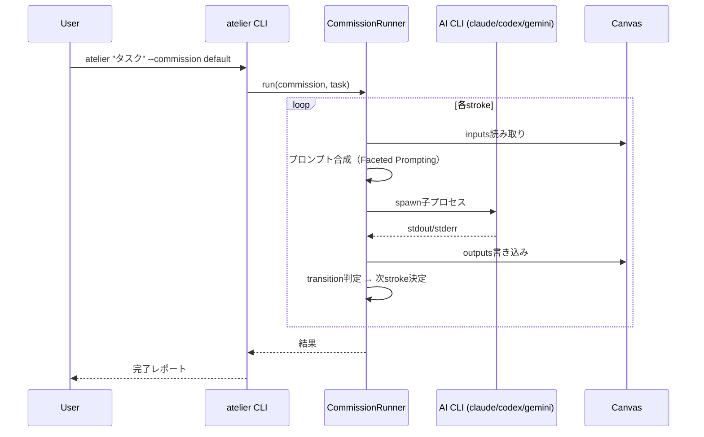
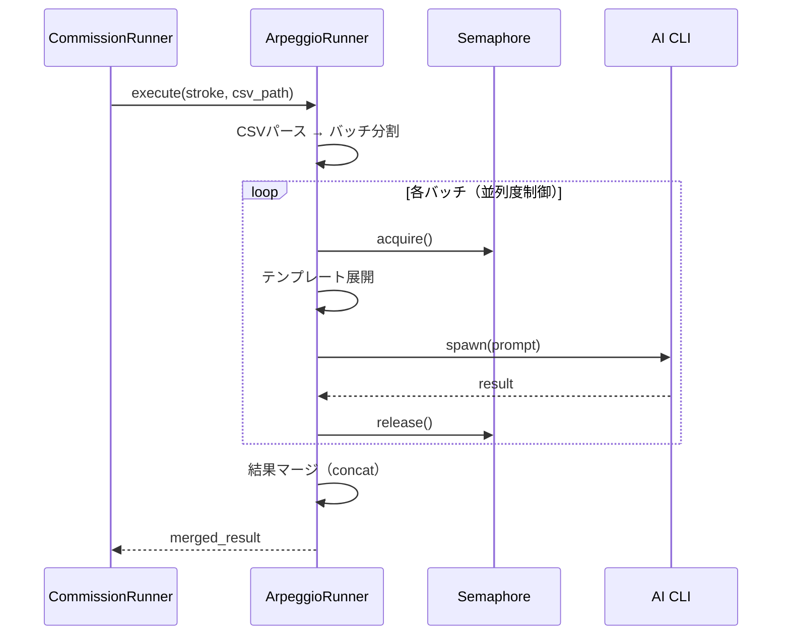
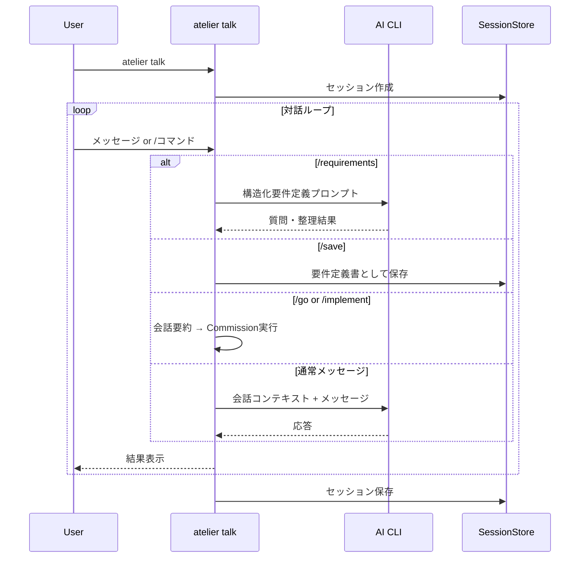
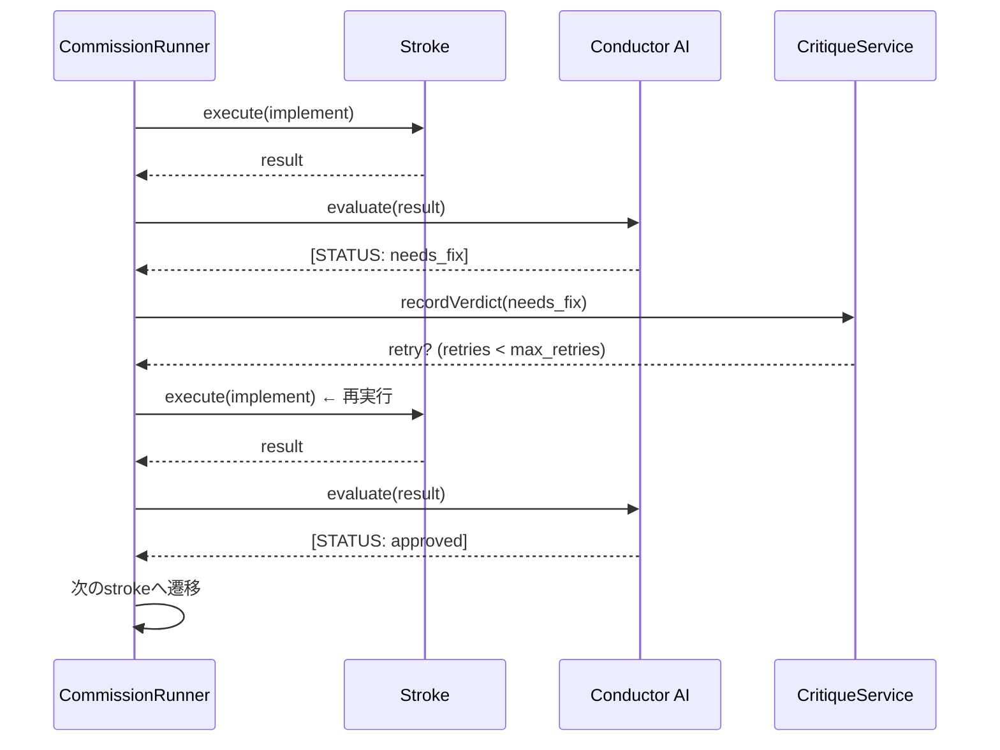
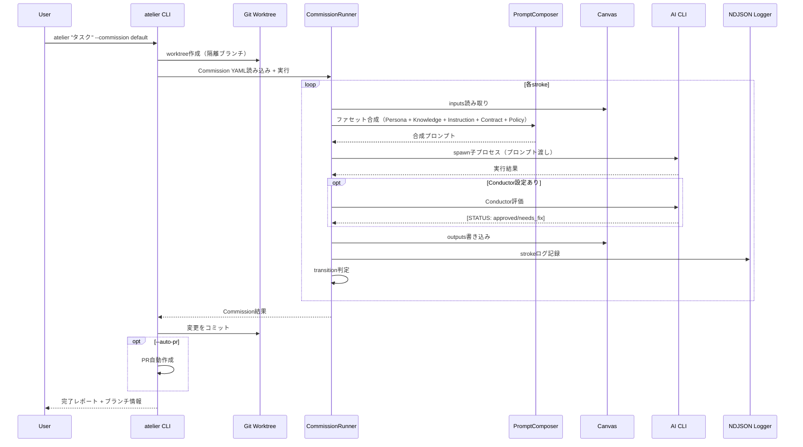
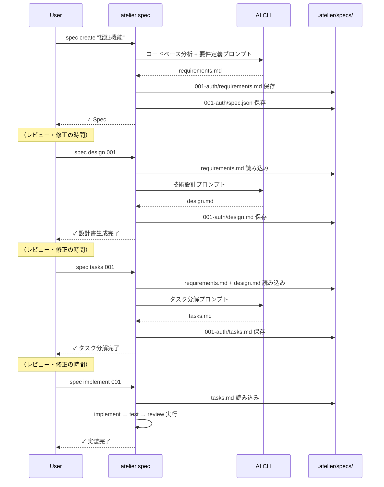
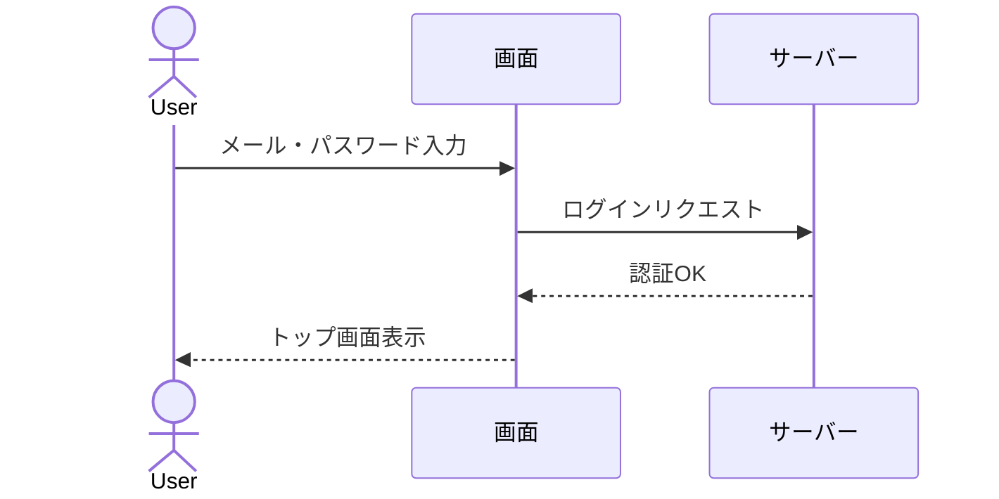
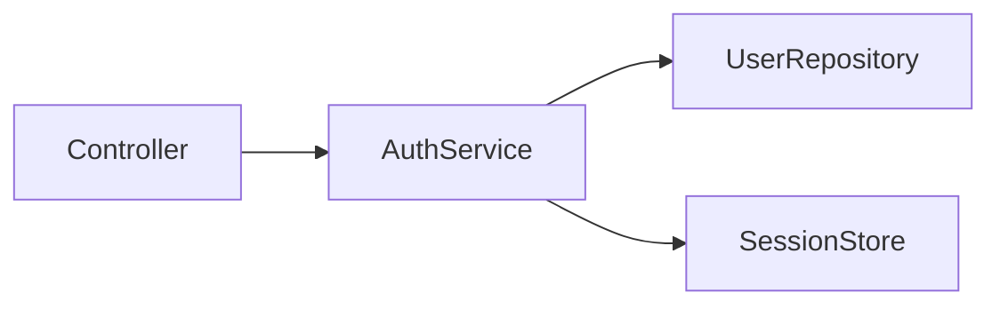

# 要件定義書

## はじめに

ATELIER（アトリエ）は、AIコーディングエージェントをYAMLで定義したワークフロー（Commission）に沿って自動実行するCLIツールである。Claude Code・Codex・Gemini CLIなど既存のサブスクリプションCLIをそのまま活用し、APIキー不要で動作する。

本仕様は、ATELIERのコア機能を安定化させ、競合（TAKT）との明確な差別化ポイントを確立することを目的とする。対象は以下の6領域である。

| 領域 | 優先度 | 現状 |
|------|--------|------|
| Commission実行エンジン | P0 | 実装済みだがテスト未整備 |
| Canvas状態管理 | P0 | 基本実装済み、テスト未整備 |
| テスト追加 | P0 | ゼロ |
| Arpeggio（CSVバッチ処理） | P1 | 実装済みだがテスト未整備 |
| talk対話モード | P1 | 実装済みだが要件定義フロー未検証 |
| Conductor/Critique | P2 | フレームワークのみ、ルール実装が空 |
| 仕様駆動開発Commission | P1 | 未実装。要件定義→設計→タスク→実装の一貫フローがない |

## 要件

### 要件1: Commission実行エンジンの安定化

**ユーザーストーリー:** As a 開発者, I want Commissionを定義して実行したときにstrokeが確実に順次/並列で処理される, so that ワークフローの結果を信頼できる

#### 受け入れ基準

1. WHEN Commission YAMLに3つ以上のstrokeが定義されている場合, THEN strokeは定義順に逐次実行される
2. WHEN strokeの`parallel`フィールドにサブストロークが定義されている場合, THEN サブストロークは並列に実行され、すべての完了を待って次に進む
3. WHEN stroke実行中にMedium（AI CLI）がタイムアウトした場合, THEN エラーが記録され、strokeのステータスが`error`になり、Commissionが適切に終了する
4. WHEN stroke実行中にMediumがゼロ以外の終了コードを返した場合, THEN エラー内容がログに記録され、transitionルールに基づいて次のアクションが決定される
5. WHEN `loop_monitors`が設定されている場合, THEN 指定されたサイクルがthresholdを超えたらon_threshold（fail/skip/force_complete）が実行される
6. WHEN `--dry-run`オプションが指定された場合, THEN AIを呼び出さず、合成されるプロンプトとstroke順序のみが表示される

#### プロセスフロー（シーケンス図）



---

### 要件2: Canvas状態管理

**ユーザーストーリー:** As a Commission作成者, I want stroke間でデータを受け渡したい, so that 前のstrokeの出力を次のstrokeで参照できる

#### 受け入れ基準

1. WHEN strokeの`outputs`に`implementation_plan`が指定されている場合, THEN そのstrokeの実行結果がCanvas上の`implementation_plan`キーに保存される
2. WHEN strokeの`inputs`に`implementation_plan`が指定されている場合, THEN Canvas上の`implementation_plan`の値がプロンプトに注入される
3. WHEN strokeのinstructionに`{{implementation_plan}}`テンプレート変数が含まれる場合, THEN Canvas上の該当値で展開される
4. WHEN 並列stroke実行前にCanvas.snapshot()が呼ばれた場合, THEN 各並列strokeは独立したCanvasコピーで動作し、他のstrokeの書き込みに影響されない
5. WHEN Canvas上に存在しないキーが参照された場合, THEN 空文字列として展開され、エラーにはならない

---

### 要件3: テスト追加

**ユーザーストーリー:** As a ATELIERの開発者, I want コア機能にユニットテストがある, so that リファクタリングやバグ修正時にリグレッションを検知できる

#### 受け入れ基準

1. WHEN `pnpm test`を実行した場合, THEN 全テストが実行され結果がレポートされる
2. WHEN CommissionRunner単体テストを実行した場合, THEN stroke順次実行、並列実行、エラーハンドリング、ループ検出の各ケースがテストされる
3. WHEN Canvas単体テストを実行した場合, THEN get/set、スナップショット/リストア、テンプレート展開がテストされる
4. WHEN PromptComposer単体テストを実行した場合, THEN 5ファセット（Persona/Knowledge/Instruction/Contract/Policy）の合成順序と内容が検証される
5. WHEN Arpeggio単体テストを実行した場合, THEN CSVパース、バッチ分割、テンプレート展開、並列実行がテストされる
6. WHEN Mediumアダプタの単体テストを実行した場合, THEN 各プロバイダー（Claude/Codex/Gemini）のコマンド構築とレスポンスパースがテストされる
7. WHEN AggregateEvaluator単体テストを実行した場合, THEN `all()`と`any()`の集約ルールが正しく評価される

#### テスト対象ファイルと優先度

| ファイル | テスト優先度 |
|---------|------------|
| `domain/services/prompt-composer.service.ts` | P0 |
| `domain/models/canvas.model.ts` | P0 |
| `domain/services/aggregate-evaluator.service.ts` | P0 |
| `application/services/commission-runner.service.ts` | P0 |
| `application/services/arpeggio-runner.service.ts` | P1 |
| `adapters/medium/claude-code.adapter.ts` | P1 |
| `adapters/medium/codex.adapter.ts` | P1 |
| `adapters/medium/gemini.adapter.ts` | P1 |
| `domain/services/critique.service.ts` | P2 |
| `domain/services/easel.service.ts` | P2 |

---

### 要件4: Arpeggio（CSVバッチ処理）

**ユーザーストーリー:** As a 開発者, I want CSVデータを行ごとにテンプレート展開してAIに並列処理させたい, so that 大量のデータ駆動タスクを効率的に実行できる

#### 受け入れ基準

1. WHEN strokeに`arpeggio.source`が指定されている場合, THEN 指定CSVファイルが読み込まれ、行ごとにパースされる
2. WHEN `arpeggio.batch_size: 5`が設定されている場合, THEN CSV行が5行ずつのバッチに分割される
3. WHEN `arpeggio.concurrency: 3`が設定されている場合, THEN 最大3バッチが同時に実行される
4. WHEN instructionに`{{batch_data}}`が含まれる場合, THEN 現在のバッチの全行データで展開される
5. WHEN instructionに`{{col:N:name}}`が含まれる場合, THEN N番目の行のname列の値で展開される
6. WHEN バッチ実行が失敗した場合, THEN 指数バックオフでリトライされ、最終的に失敗したバッチがレポートされる
7. WHEN 全バッチが完了した場合, THEN `arpeggio.merge`戦略（concat）に従って結果がマージされる

#### プロセスフロー（シーケンス図）



---

### 要件5: talk対話モード

**ユーザーストーリー:** As a 開発者, I want AIと対話して要件を整理し、そのままCommissionを実行したい, so that 要件定義から実装までシームレスに進められる

#### 受け入れ基準

1. WHEN `atelier talk`を実行した場合, THEN 対話セッションが開始され、プロジェクトのPolicyが自動適用される
2. WHEN 対話中に`/requirements`を入力した場合, THEN 構造化要件定義モードに切り替わり、AIが質問を通じて要件を整理する
3. WHEN 対話中に`/analyze`を入力した場合, THEN 会話履歴から要件が自動抽出され、矛盾・抜け漏れが検出される
4. WHEN 対話中に`/save`を入力した場合, THEN 会話内容が要件定義書としてファイルに保存される
5. WHEN 対話中に`/implement`を入力した場合, THEN 整理された要件をもとにCommissionが実行される
6. WHEN 対話中に`/go`を入力した場合, THEN 会話が要約され、Commission選択UIが表示されて実行される
7. WHEN セッションが終了した場合, THEN 会話履歴が`.atelier/sessions/`に保存され、`/resume`で復帰できる

#### プロセスフロー（シーケンス図）



---

### 要件6: Conductor/Critique完成

**ユーザーストーリー:** As a Commission作成者, I want stroke完了後にAIが結果を評価し、承認/修正の判定を自動で行いたい, so that 人手によるレビュー判定を省力化できる

#### 受け入れ基準

1. WHEN strokeに`conductor`フィールドが定義されている場合, THEN stroke完了後にconductor用のAI呼び出しが実行される
2. WHEN conductorが`[STATUS: approved]`を返した場合, THEN conductor.rulesの`approved`条件に基づいて次のstrokeに遷移する
3. WHEN conductorが`[STATUS: needs_fix]`を返した場合, THEN conductor.rulesの`needs_fix`条件に基づいてstrokeが再実行される
4. WHEN 並列strokeの結果を集約する場合, THEN `all("approved")`は全サブストロークがapprovedの時にtrue、`any("needs_fix")`はいずれかがneeds_fixの時にtrueとなる
5. WHEN Critiqueのリトライ回数が`max_retries`を超えた場合, THEN `on_max_retries`（fail/skip/continue）に従って処理される
6. WHEN conductorのpaletteが未指定の場合, THEN ビルトインの`conductor` paletteがデフォルトで使用される

#### プロセスフロー（シーケンス図）



---

## システム全体のプロセスフロー



### 要件7: 仕様駆動開発（Spec-Driven Development）

**ユーザーストーリー:** As a 開発者, I want 要件定義・設計・タスク分解を段階的に作成し、好きなタイミングで実装に進みたい, so that 仕様を十分に検討してから実装でき、かつ小さなタスクには使わない選択もできる

#### 7-A: `atelier spec` サブコマンド（段階的実行）

##### 受け入れ基準

1. WHEN `atelier spec create "ユーザー認証機能"` を実行した場合, THEN AIがコードベースを分析し `.atelier/specs/{NNN}-{名前}/requirements.md` と `spec.json` を生成する
2. WHEN `atelier spec design {ID}` を実行した場合, THEN 該当specの `requirements.md` を読み込み `design.md` を生成する
3. WHEN `atelier spec tasks {ID}` を実行した場合, THEN `requirements.md` と `design.md` を読み込み `tasks.md` を生成する
4. WHEN `atelier spec implement {ID}` を実行した場合, THEN `tasks.md` を読み込み implement → test → review Commission を実行する
5. WHEN `atelier spec list` を実行した場合, THEN 全specの一覧が「ID / 名前 / フェーズ / 更新日」で表示される
6. WHEN `atelier spec show {ID}` を実行した場合, THEN 該当specの仕様書内容とフェーズ状態が表示される
7. WHEN 前提フェーズが未完了の状態で後続コマンドを実行した場合（例: requirements未生成で `spec design`）, THEN エラーメッセージで前提ステップを案内する

##### プロセスフロー（シーケンス図）



#### 7-B: `--commission spec-driven`（一気通貫実行）

##### 受け入れ基準

1. WHEN `atelier "機能" --commission spec-driven` を実行した場合, THEN requirements → design → tasks → implement → test → review の6 strokeが一気に実行される
2. WHEN 一気通貫実行が完了した場合, THEN `.atelier/specs/{NNN}-{名前}/` に仕様書3点セットが保存され、かつ実装も完了している

#### 7-C: talk対話モードとの統合

##### 受け入れ基準

1. WHEN `atelier talk` で `/spec` を入力した場合, THEN 会話内容から仕様書3点セットのみ生成される（実装はしない）
2. WHEN `/spec implement` を入力した場合, THEN 仕様書3点セット生成 + 実装まで一気通貫で実行される

#### 7-D: 仕様書フォーマット

生成される仕様書は以下の原則に従う：

- **トークン効率**: 冗長な説明を省き、表・リスト・図で構造化する
- **AI可読性**: 明確なセクション区切りと一貫した命名で、後続strokeが確実にパースできる
- **非エンジニア可読性**: 専門用語を避け、「何ができるか」「どう動くか」を平易な言葉で書く

##### ファイル構造

```
.atelier/specs/{NNN}-{名前}/
├── spec.json          # メタデータ（フェーズ、更新日）
├── requirements.md    # 要件定義書
├── design.md          # 技術設計書
└── tasks.md           # 実装タスク書
```

##### spec.json

```json
{
  "id": "001",
  "name": "user-auth",
  "description": "ユーザー認証機能",
  "phase": "requirements",
  "created_at": "2026-03-30",
  "updated_at": "2026-03-30"
}
```

`phase` の遷移: `requirements` → `design` → `tasks` → `ready` → `implemented`

##### requirements.md フォーマット

```markdown
# 要件定義: {機能名}

## 背景
（なぜこの機能が必要か。非エンジニアが読んでも理解できる1-2段落）

## ゴール
- この機能で何が実現されるか（箇条書き）

## 要件一覧

| # | 要件 | 優先度 | 完了条件 |
|---|------|--------|---------|
| 1 | ログインできる | Must | メール+パスワードでログインし、トップ画面に遷移する |
| 2 | ログアウトできる | Must | ボタン押下でセッション破棄、ログイン画面に戻る |
| 3 | パスワードリセット | Should | メールでリセットリンクを受信し、新パスワードを設定できる |

## 操作の流れ

（ユーザー目線の操作手順。Mermaid図で可視化）



## 対象外
- 今回やらないこと（スコープ外の明記）

## 未決事項
- 確認が必要な点（あれば）
```

##### design.md フォーマット

```markdown
# 技術設計: {機能名}

## 方針
（1-2文で設計の方針を要約）

## 要件→設計マッピング

| 要件# | 設計要素 | 変更ファイル |
|--------|---------|-------------|
| 1 | AuthService.login() | src/services/auth.ts |
| 2 | AuthService.logout() | src/services/auth.ts |

## 構成図



## 変更ファイル一覧

| ファイル | 変更内容 | 新規/修正 |
|---------|---------|----------|
| src/services/auth.ts | 認証ロジック | 新規 |
| src/controllers/login.ts | ログイン画面 | 新規 |

## データの流れ
（入力→処理→出力を箇条書きまたは図で）

## エラー時の動作

| エラー | 対処 |
|--------|------|
| パスワード不一致 | 「メールまたはパスワードが違います」表示 |

## テスト方針
（何をテストするか箇条書き）
```

##### tasks.md フォーマット

```markdown
# 実装タスク: {機能名}

- [ ] 1. AuthServiceの作成
  - `src/services/auth.ts` に login/logout メソッド実装
  - _要件: 1, 2_

- [ ] 2. ログイン画面の作成
  - `src/controllers/login.ts` を新規作成
  - フォーム: メール + パスワード + ログインボタン
  - _要件: 1_ / _依存: 1_

- [ ] 3. テスト作成
  - AuthService の正常系・異常系テスト
  - _要件: 1, 2_ / _依存: 1, 2_
```

---

## Open Questions

1. **Conductor Palette の内容**: ビルトインの`conductor.yaml`のペルソナ定義は現状で十分か？判定精度を上げるためにどのような指示が必要か？
2. **Arpeggio のマージ戦略**: 現在`concat`のみだが、`reduce`（集約）や`group`（グループ化）などの追加戦略が必要か？
3. **talk セッションの永続化範囲**: 会話履歴はどこまで保持すべきか？全履歴か、直近N件か？
4. **テストにおけるMediumのモック方針**: Mediumアダプタのテストでは実際のCLIを呼ぶ統合テストも必要か、モックのみで十分か？
