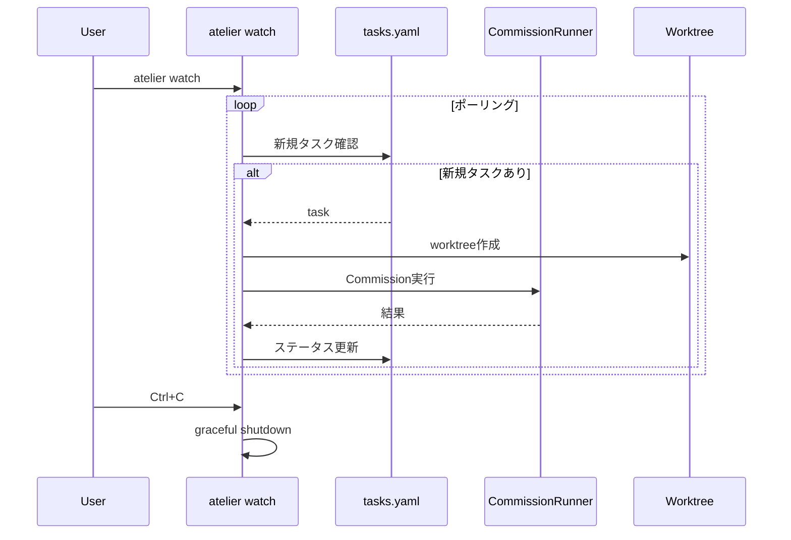
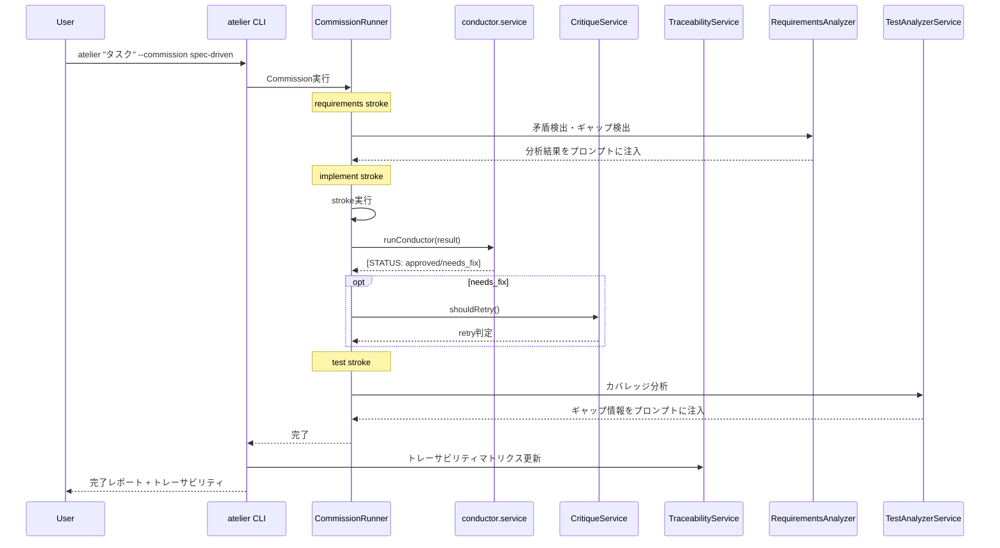

# 要件定義書

## はじめに

ATELIERのPhase 1（core-stabilization）でコア機能のテスト・安定化・仕様駆動開発Commissionの追加を完了した。Phase 2では、調査で判明した未完成機能を完成させ、ATELIERを「公開可能な品質」に引き上げる。

対象は以下の5領域である。

| 領域 | 優先度 | 現状 |
|------|--------|------|
| Conductor二重実装の統合 | P0 | conductor.service.ts（181行）とcommission-runner内実装（120行相当）が並存。conductor.service.tsは未使用 |
| TraceabilityService完成 | P1 | スタブ（97行）。どこからも呼ばれていない |
| 未使用サービスのCommission統合 | P1 | RequirementsAnalyzer（446行）・TestAnalyzer（501行）が実装済みだがCommission内で未使用 |
| watch.cmd / pipeline.cmd完成 | P1 | 部分実装。UseCase層との接続確認・補完が必要 |
| serve.cmd完成 | P2 | スタブ（37行）。ハンドラー実装が不明確 |

## 要件

### 要件1: Conductor二重実装の統合

**ユーザーストーリー:** As a ATELIER開発者, I want Conductor実装が1箇所に統一されている, so that バグ修正・機能追加時に修正漏れが発生しない

#### 背景

Phase 1で`conductor.service.ts`と`conductor-parser.ts`を新規作成したが、`commission-runner.service.ts`内に既存の`runConductorPhase`/`executeConductor`メソッドがある。現在2つの実装が並存しており、conductor.service.tsはどこからも呼ばれていない。

#### 受け入れ基準

1. WHEN commission-runner内のConductor関連メソッド（runConductorPhase, executeConductor）を確認した場合, THEN conductor.service.tsのrunConductor関数に置き換えられている
2. WHEN commission-runner.service.tsからConductor処理が呼ばれる場合, THEN conductor.service.tsのrunConductor()が使用される
3. WHEN conductor.service.tsのrulesマッチングが実行される場合, THEN stroke定義のconductor.rulesに基づいてnextStrokeが正しく決定される
4. WHEN 統合後に既存テスト（332件）を実行した場合, THEN 全テストがパスする
5. WHEN conductor統合のテストを実行した場合, THEN commission-runner経由でconductor.service.tsが呼ばれることが検証される

---

### 要件2: TraceabilityService完成

**ユーザーストーリー:** As a 開発者, I want 要件→設計→タスク→実装のトレーサビリティを自動管理したい, so that 仕様変更時に影響範囲を追跡できる

#### 背景

現在のTraceabilityService（97行）はトレースリンク作成・マトリクス生成・未トレース検出の枠組みのみ。Phase 1で追加したspec-driven開発（requirements.md → design.md → tasks.md）と連携させることで、仕様駆動開発の価値が大きく高まる。

#### 受け入れ基準

1. WHEN `.atelier/specs/{ID}/` に requirements.md と design.md が存在する場合, THEN TraceabilityServiceが要件番号と設計要素の対応を自動検出できる
2. WHEN tasks.md に `_要件: N_` 形式の参照がある場合, THEN TraceabilityServiceがタスク→要件の逆引きマトリクスを生成できる
3. WHEN `atelier spec show {ID}` を実行した場合, THEN トレーサビリティマトリクス（要件 × 設計 × タスク）が表示される
4. WHEN 要件のうちタスクに紐付いていないものがある場合, THEN 「未カバー要件」として警告される
5. WHEN TraceabilityServiceの単体テストを実行した場合, THEN マトリクス生成・未カバー検出のテストがパスする

---

### 要件3: 未使用サービスのCommission統合

**ユーザーストーリー:** As a 開発者, I want 既存の分析サービスがCommissionワークフロー内で活用される, so that ワークフロー実行中に自動で要件分析・テスト分析が行われる

#### 背景

RequirementsAnalyzerService（446行、完全実装）とTestAnalyzerService（501行、完全実装）がCommission内で使われていない。既存のビルトインCommission（requirements-analysis, test-enhancement）に接続することで価値が出る。

#### 受け入れ基準

1. WHEN `requirements-analysis` Commissionのvalidateストロークが実行される場合, THEN RequirementsAnalyzerServiceの矛盾検出・ギャップ検出が活用される
2. WHEN `test-enhancement` Commissionのcoverageストロークが実行される場合, THEN TestAnalyzerServiceのカバレッジ解析が活用される
3. WHEN `test-enhancement` Commissionのgapsストロークが実行される場合, THEN TestAnalyzerServiceのギャップ検出結果がプロンプトに注入される
4. WHEN 統合後のCommission定義を検証した場合, THEN 各ストロークのinstructionにサービス呼び出し結果の活用方法が記述されている
5. WHEN 統合テストを実行した場合, THEN requirements-analysis/test-enhancement Commissionの構造的整合性が確認される

---

### 要件4: watch.cmd / pipeline.cmd完成

**ユーザーストーリー:** As a 開発者, I want watchモードとCI/CDパイプラインが安定して動作する, so that タスクの自動実行とCI統合を信頼できる

#### 背景

watch.cmd（348行）はタスクキュー監視・Commission実行まで実装済みだが、DirectRunUseCaseとの接続やエラーリカバリが未検証。pipeline.cmd（204行）はCommission実行・自動PR作成まで実装済みだが、PipelineRunUseCaseの実装状態が不明確。

#### 受け入れ基準

1. WHEN `atelier watch` を実行した場合, THEN tasks.yamlを監視し、新規タスク追加時にCommissionが自動実行される
2. WHEN watchモードでタスク実行中にエラーが発生した場合, THEN エラーがログに記録され、次のタスクの処理に影響しない
3. WHEN watchモードでCtrl+Cが押された場合, THEN 実行中のタスクを待機してgraceful shutdownする
4. WHEN `atelier pipeline run <name>` を実行した場合, THEN 指定CommissionがCI環境で正しく実行される
5. WHEN pipeline実行に `--auto-pr` オプションが付いている場合, THEN 完了後にPRが自動作成される
6. WHEN pipeline実行が失敗した場合, THEN 非ゼロ終了コードが返され、エラー詳細がstderrに出力される
7. WHEN watch/pipelineの単体テストを実行した場合, THEN 主要なケースがテストされる

#### プロセスフロー（シーケンス図）

---

### 要件5: serve.cmd完成

**ユーザーストーリー:** As a 開発者, I want ATELIERをWebSocket APIとして起動し、外部ツール（IDE拡張等）から操作したい, so that CLIだけでなくGUIフロントエンドからも使える

#### 背景

serve.cmd（37行）はWebSocketサーバー起動とハンドラー登録のみ。ws-server.ts（124行）はJSON-RPC 2.0プロトコル対応で完全実装。fs-handler.ts/workspace-handler.tsが存在するが実装状態が不明。

#### 受け入れ基準

1. WHEN `atelier serve` を実行した場合, THEN WebSocketサーバーが指定ポート（デフォルト: 3000）で起動する
2. WHEN WebSocketクライアントが接続し `{"method": "commission.run", "params": {...}}` を送信した場合, THEN CommissionRunnerが実行され結果がJSON-RPCレスポンスで返される
3. WHEN `{"method": "spec.list"}` を送信した場合, THEN .atelier/specs/の一覧がレスポンスで返される
4. WHEN `{"method": "fs.read", "params": {"path": "..."}}` を送信した場合, THEN ファイル内容がレスポンスで返される
5. WHEN サーバー実行中にCommissionが進行している場合, THEN stroke完了ごとにプログレスイベントがブロードキャストされる
6. WHEN serve.cmdのテストを実行した場合, THEN JSON-RPCリクエスト/レスポンスのパターンが検証される

---

## システム全体のプロセスフロー

## Open Questions

1. **serve.cmdのAPI仕様**: JSON-RPCメソッド一覧をどこまで充実させるか？最小限（commission.run, spec.list, fs.read）で十分か？
2. **watchの並列度**: watchモードで複数タスクを並列実行する必要があるか？現状は逐次処理。
3. **RequirementsAnalyzerの活用方法**: Commission内のstrokeから直接呼ぶか、プロンプトのKnowledgeとして分析結果を注入するか？
4. **TraceabilityServiceの更新タイミング**: spec実行完了後に自動更新するか、手動コマンド（`atelier spec trace {ID}`）で更新するか？
