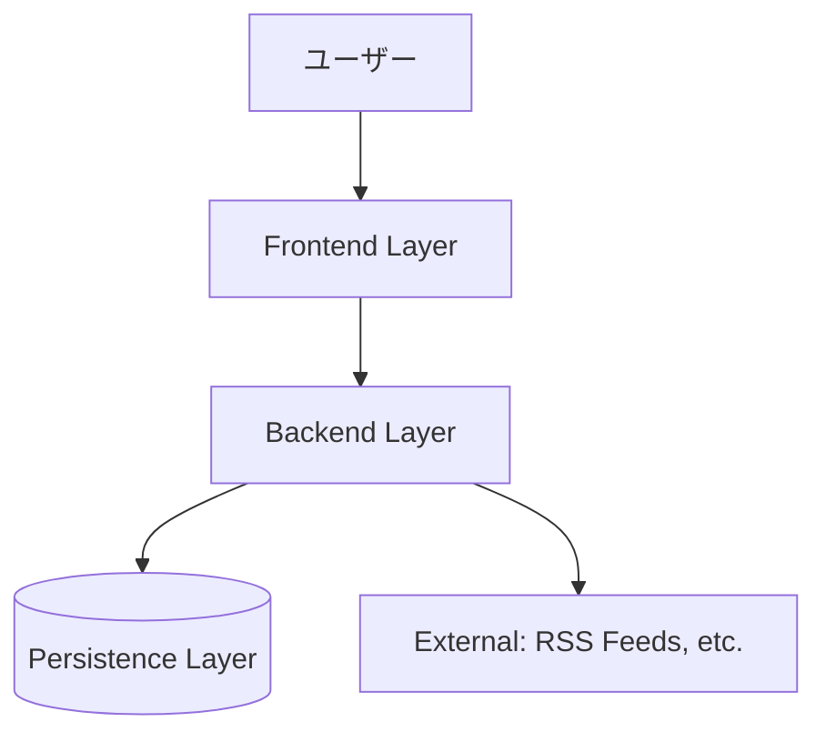
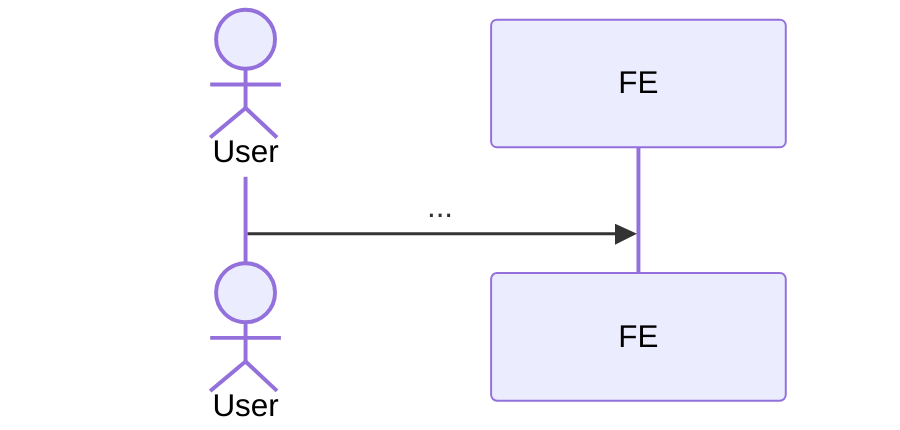

あなたは toC アーキテクトとして、確定スタックと ADR を踏まえた**Google 式 Design Doc**を作成してください。Industrial Empathy "Design Docs at Google" を体現します。

## 入力
{{requirements}}
{{pr_faq}}
{{outcome}}
{{tech_synthesis}}
{{adr_summary}}

## 目的

実装着手前に「Context / Goals / Non-Goals / Design Detail / Alternatives / Cross-cutting Concerns」を網羅した設計書を作成する。これは後続の tasks 生成と実装の地図となる。

## 出力フォーマット

```markdown
# Design Doc: {プロダクト名} MVP

> Date: {YYYY-MM-DD}
> Author: {Architect}
> Status: Draft / Reviewed / Approved
> Related: [PR-FAQ](../pr-faq.md), [Outcome](../outcome.md), [Tech Synthesis](../tech-selection/synthesis.md)

## 1. Context

- なぜ今これを作るか（1-2段落）
- ユーザーが抱える課題ループ
- 関連する組織・ビジネス文脈
- 制約（納期 / チーム / 既存資産）

## 2. Goals

3〜7項目で、**測定可能な達成状態**を書く：
- ...
- ...

## 3. Non-Goals

3〜7項目で、**意図的にやらないこと**を書く（Squarespace "Yes, if" 風）：
- ...
- ...

各 Non-Goal に "Yes, if"（採用検討する条件）を付ける。

## 4. Design Detail

### 4.1 全体構成



### 4.2 モジュール分離

| モジュール | 責務 | 主要ファイル |
|----------|-----|------------|
| Catalog | RSS URL CRUD / フィード正規化 | ... |
| Playback | エピソード再生 / 位置保存・復帰 | ... |
| Discovery | ユーザー観察ログ / イベント記録 | ... |
| ... | ... | ... |

### 4.3 データモデル

| テーブル | カラム | 型 | 制約 | 説明 |
|---------|-------|-----|------|------|
| podcasts | id, rss_url, title, last_fetched_at | ... | ... | ... |
| episodes | id, podcast_id, guid, title, audio_url, published_at, duration_sec | ... | ... | ... |
| ... | ... | ... | ... | ... |

データ整合性キー：
- `(feedUrl, episodeGuid)` で episode を一意化
- ...

### 4.4 主要 UseCase シーケンス



### 4.5 永続化 I/F（Persistence Adapter）

```typescript
interface PlaybackStateAdapter {
  read(episodeId: string): Promise<PlaybackState | null>;
  write(episodeId: string, state: PlaybackState): Promise<void>;
}

class LocalAdapter implements PlaybackStateAdapter { /* localStorage */ }
class RemoteAdapter implements PlaybackStateAdapter { /* DB */ }
```

### 4.6 エラー時の動作

| エラー | 検知箇所 | 対処 | UX |
|-------|---------|------|----|
| ... | ... | ... | ... |

### 4.7 API 設計（必要なら）

| Method | Path | 説明 | リクエスト | レスポンス |
|--------|------|-----|----------|----------|
| ... | ... | ... | ... | ... |

## 5. Alternatives Considered

### 案 A: {却下案 1}
- 検討内容：...
- 却下理由：...
- Yes, if：...

### 案 B: {却下案 2}
（最低3案、各 ADR が扱うものより**設計全体に対する代替案**を）

### 案 C: {却下案 3}

## 6. Cross-cutting Concerns

### 6.1 可観測性
- 構造化ログのフィールド
- 4 Golden Signals 計測点
- SLO の定義

### 6.2 セキュリティ
- Synthesis Step 6 の譲歩不可ラインを実装ガイドラインに展開
- 認証・認可（N=1 では「self」テナンシ）

### 6.3 パフォーマンス
- 初期 JS バンドル予算（< N KB）
- API レイテンシ目標（p99 < N ms）

### 6.4 スケーラビリティ
- 現状（N=1）の前提
- β以降の昇格パス（ADR-N に紐づく）

### 6.5 デプロイ・運用
- MVP のローカル実行手順
- β以降の Cloudflare Workers + D1 などへの切替

## 7. Implementation Plan

### 7.1 マイルストン（時系列）

| 日 | 達成状態 | DoD |
|----|--------|-----|
| Day 1 | ... | ... |
| Day 2 | ... | ... |
| Day 3 | ... | ... |
| Day 4 | ... | ... |
| Day 5 | ... | ... |

### 7.2 DoD（Definition of Done）

機能・品質・観測性の合計チェックリスト：
- [ ] MVP 機能 3 つ動作
- [ ] E2E スモーク 1 本グリーン
- [ ] セキュリティ必須要件のうち MVP 低コスト分実装
- [ ] 観測性最小セット動作
- [ ] N=1 自己エスノグラフィの初回ログ収集
- [ ] PR-FAQ の主仮説（差別化点）の確認手段が動く

## 8. Open Questions

- ...

## 9. Future Work

- ...
```

## 品質基準

- **Goals と Non-Goals の比率**：Non-Goals は Goals と同等以上の精度で書く
- **Alternatives Considered**：最低3案、各案に Yes, if 付き
- **Mermaid 図は最低2つ**：全体構成 + 主要 UseCase シーケンス
- **データモデルはカラム単位**：型・制約・説明を含める
- **DoD はチェックボックス形式**：機能 + 品質 + 観測性で網羅

## 原則

- **Why before How を全セクションで**：「なぜこの設計か」を先に書く
- **N=1 の現実を尊重**：β以降の昇格パスは ADR に逃がし、本文では深追いしない
- **横断検討は省略しない**：可観測性 / セキュリティ / 性能 / スケール / 運用の5項目は必ず触れる
- **DoD は機能だけでない**：観測性と検証可能性を必ず含める

## 保存

生成した Design Doc を `{{project_path}}/.atelier/specs/{{spec_dir}}/design.md` に保存してください。
